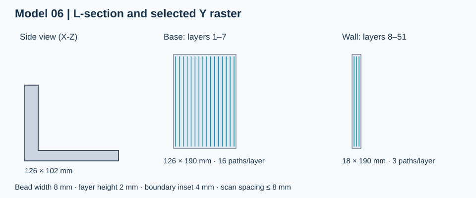
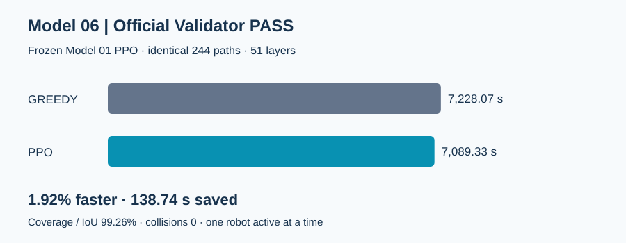

# Model 06 — Greedy / Constrained PPO

**두 알고리즘 모두 공식 WAAM Validator 1.0.1 PASS.**

Model 06의 L자 단면(밑판 + 벽)을 분석하여 폭에 맞춘 Y방향 Raster를 선택했다.
동일한 51개 층, 244개 경로에 Model 01의 학습된 PPO를 재학습 없이 적용했다.



| 지표 | Greedy | Constrained PPO |
|---|---:|---:|
| Makespan | 7,228.07 s | **7,089.33 s** |
| Coverage | 99.26% | 99.26% |
| IoU | 99.26% | 99.26% |
| 충돌 | 0건 | 0건 |
| 최소 배정 경로 Reach 여유 | 7.268 mm | 11.086 mm |
| Validator | PASS | PASS |

**1.92% 개선, 138.74초(약 2분 19초) 단축.** Safety Filter 개입은 3회다.



## 검증 자료

- [결과 JSON](./summary.json)
- [Greedy 공식 보고서](./greedy_validation_report.md)
- [PPO 공식 보고서](./ppo_validation_report.md)
- [TensorBoard 로그](./tensorboard/model06/)

```bash
tensorboard --logdir progress/Model06_Experiments/tensorboard
```

Step 6은 모델 번호이며 학습 횟수가 아니다. 재학습 없이 평가한 지표와 공식 PASS 여부를 기록했다.

경로 선택은 Model05 Raster, X방향 적응형 Raster, Y방향 적응형 Raster를 모든 층에서 비교했다.
선택된 Y방향 경로의 층별 최소 기하 IoU는 99.12%였다. 간격은 8mm 이하, 외곽 여유는 4mm이며
밑판 층에는 16개, 벽 층에는 3개 경로를 배치했다.

기존 스케줄러처럼 한 로봇씩 순차 실행했다. 개선은 이동·홈 복귀 시간 차이이며,
세 로봇 동시 작업 최적화나 실제 장비 안전성을 입증하는 결과로 해석하지 않는다.
원본 코드, STL/config, PPO 체크포인트는 이 결과 업로드에 포함하지 않았다.
기존 Model 01~05 코드는 수정하지 않았다.
