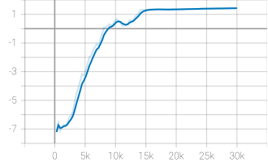
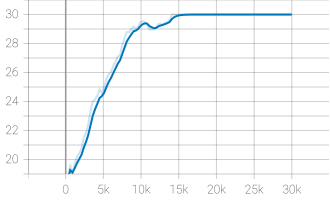
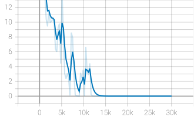

# PPO 기반 WAAM 다중 로봇 작업 할당 — Model 01

## 1. 실험 목적

Honeycomb 형상(Model 01)의 작업 30개를 3대의 로봇에 배정하는 PPO 강화학습 모델을 구현하고 학습 성능을 분석한다.

## 2. 학습 설정

- Algorithm: PPO
- Training Timesteps: 30,000
- Random Seed: 42
- Observation Space: 13 dimensions
- Action Space: Discrete(3)
- Policy: MLP [64, 64]

## 3. TensorBoard 학습 결과

### Reward 변화

평균 Reward가 초기 약 -7에서 최종 약 1.43으로 증가하여 학습이 진행되었음을 확인했다.

### Episode Length 변화

초기 약 19에서 최종 30까지 증가하여 작업 배정의 조기 종료가 감소했다.

### Value Loss 변화

초기 큰 변동을 보였으나 학습 후반에는 약 0.0003까지 감소했다.

## 4. 기존 실험 결과

- Greedy Makespan: 1,654.84초
- PPO Makespan: 1,643.83초
- 개선율: 약 0.67%
- WAAM Validator: PASS (기존 실험 기준)

## 5. 한계 및 향후 개선 방향

현재 PPO 모델은 Honeycomb 형상에 특화되어 있어 다른 형상에 대한 적용 가능성이 검증되지 않았다.

향후 01~06 모델에 대한 적용 범위를 확대하고, 범용 경로 생성 및 새로운 형상에 대한 일반화 성능 검증을 수행할 계획이다.