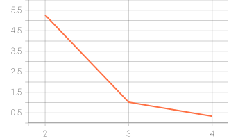

# WAAM 다중 로봇 작업 배정 및 Makespan 최적화 — 진행 기록

> **1차 실험 정리 | 2026-10-08**  
> 3대 로봇의 WAAM(Wire Arc Additive Manufacturing) 작업을 대상으로, STL 형상별 적층 경로를 생성하고 로봇 도달 가능성·형상 정확도·충돌 조건을 확인한 뒤 작업 완료시간(Makespan)을 최소화하는 프로젝트입니다.

## 한눈에 보는 진행 상황

- **Model 01~05:** 모델별 실험 수행 및 공식 WAAM Validator PASS 기록 확보
- **Model 02~05:** Model 01에서 학습한 PPO 정책을 *재학습 없이* 적용하고 Greedy 대비 Makespan 감소 확인
- **경로 생성:** 얇은 벽의 Centerline → 넓은 면적을 위한 Hybrid → 대형 형상의 Raster-only로 발전
- **안전 제약:** 로봇의 XY 도달 범위를 확인하는 Safety Filter 도입; Model 05에는 별도의 **5 mm 도달 여유 제약** 적용
- **시각화:** TensorBoard 학습 지표와 모델별 PPO 일반화 평가를 GitHub에 기록
- **다음 목표:** Model 06 형상 분석 및 Greedy/PPO 공식 검증

## 1. 모델별 최종 성과

| 모델 | 채택한 경로 생성 방식 | 레이어 / 작업 경로 | Greedy Makespan | Constrained PPO Makespan | 단축률 | Validator |
|---|---|---:|---:|---:|---:|---|
| [01](./PPO_Model01/README.md) | Honeycomb 기준 실험 | 작업 30개 | 1,654.84 s | **1,643.83 s** | **0.67%** | PASS (기존 실험) |
| [02](./Model02_Experiments/README.md) | Centerline + Reach 분할 | 8층 / 24개 | 2,468.05 s | **2,338.05 s** | **5.27%** | 양쪽 PASS |
| [03](./Model03_Experiments/README.md) | Centerline + Reach 분할 | 6층 / 144개 | 2,227.78 s | **2,205.13 s** | **1.02%** | 양쪽 PASS |
| [04](./Model04_Experiments/README.md) | Centerline + Raster Hybrid | 50층 / 13,508개 | 113,437.75 s | **113,062.00 s** | **0.33%** | 양쪽 PASS |
| [05](./Model05_Experiments/README.md) | Raster-only + Reach-aware Greedy | 350층 / 75,868개 | 409,508.19 s | **406,350.91 s** | **0.77%** | 양쪽 PASS* |
| 06 | 형상 분석 및 알고리즘 선정 예정 | — | — | — | — | 미진행 |

**Makespan**은 시뮬레이션상 전체 작업 완료시간(초)입니다. 서로 다른 모델은 형상과 작업 수가 다르므로, **모델 간 절대 시간보다 같은 모델 안에서의 Greedy–PPO 비교**에 의미가 있습니다.

\* Model 05의 **PPO 공식 PASS**는 2026-10-08 로컬 WAAM Validator 실행 결과로 확인했습니다(Coverage 및 IoU 약 91.14%, 충돌 0건). 현재 GitHub의 Model 05 개별 README/JSON에는 구버전의 ‘검증 진행 중’·‘NOT_RUN’ 기록이 남아 있어, **최신 공식 검증 요약과 보고서 업로드가 후속 작업**입니다. 이 표는 로컬 최종 결과를 반영합니다.

## 2. 개발·개선 과정

### Model 01 — PPO 학습 기반 구축

- Honeycomb 형상의 **30개 작업 / 3대 로봇** 배정을 위한 PPO 강화학습 환경 구현
- 학습 설정: **30,000 timesteps, seed 42, 관측값 13개, 로봇 선택 행동 3개, MLP [64, 64]**
- TensorBoard에서 **Reward, Episode Length, Value Loss**를 기록
- 기존 기준 실험에서 Makespan **0.67% 단축** 및 Validator PASS 보고

[Model 01 학습 과정과 그래프 보기](./PPO_Model01/README.md)

### Model 02 — 실패 분석을 통한 Centerline·Safety Filter 도입

1. 내부 축소 Raster는 얇은 벽을 충분히 채우지 못해 **Coverage 5.03%**로 FAIL.
2. 축소 없는 Raster는 Coverage가 높아졌지만 과적층으로 **IoU 59.36%**에 그쳐 FAIL.
3. Centerline으로 형상 추종 문제를 개선했으나 긴 경로의 로봇 도달 범위 위반 발생.
4. **Centerline 분할 + Reach-aware Greedy**로 Coverage **99.14%**, IoU **98.33%**, 충돌 **0건**, 공식 PASS.
5. PPO가 도달 불가능한 로봇을 선택한 문제는 **Safety Filter**로 해결. 24개 작업 중 8개 선택 변경, 작업시간 **5.27% 단축** 및 공식 PASS.

[Model 02 실험 기록](./Model02_Experiments/README.md)

### Model 03 — 복잡한 내부 구조로 확장

- 내부 구멍이 많은 형상에 Model 02의 Centerline 접근법을 적용
- **6층, 144개 경로**, Coverage **98.66%**, IoU **98.16%**, 충돌 **0건**
- 추가 학습 없이 PPO 평가: **1.02% Makespan 개선**, Greedy·PPO 공식 PASS

[Model 03 실험 기록](./Model03_Experiments/README.md)

### Model 04 — 넓은 내부 면적의 미적층 문제 해결

- Centerline 단독 시 **Coverage/IoU 약 29.12%**, 공식 FAIL
- **Centerline + Raster Infill (Hybrid)**로 전환하고 간격을 조정
- 최종 공식 검증: Coverage **96.14%**, IoU **96.13%**, 충돌 **0건**, PASS
- **13,508개 작업**에 동결된 PPO 정책 및 Safety Filter 적용: **120회 개입**, Makespan **0.33% 개선**, 공식 PASS

[Model 04 실험 기록과 검증 보고서](./Model04_Experiments/README.md)

### Model 05 — 대형 형상과 반복 계산 최적화

- **350층, 75,868개 경로**의 대형 STL 형상
- Centerline 단독의 낮은 사전 형상 충전율 확인 → Hybrid/Raster 간격 비교 → **Raster-only 5.5 mm** 채택
- 350층 사전 형상 검사: 평균 IoU **91.21%**, 최저 **90.66%**, 90% 미만 **0층**
- 도달 가능성 확인 후 **최소 5 mm XY Reach 여유**를 둔 Greedy 배정: fallback **0건**
- Greedy 공식 Validator **PASS**: Coverage/IoU 약 **91.14%**, 충돌 **0건**
- 원본 작업 경로를 별도 캐시에 저장하여 STL 슬라이싱과 경로 생성을 반복하지 않고 **75,868개 동일 경로를 PPO에 재사용**
- 기존 Model 01 PPO 정책에 5 mm Reach Safety Filter 적용: **217회 개입**, 최소 도달 여유 **5.425 mm**
- PPO 공식 Validator **PASS**: Makespan **409,508.19 → 406,350.91 s**, **약 3,157.28초(52분 37초), 0.77% 단축**; Coverage/IoU 약 **91.14%**, 충돌 **0건**

[Model 05 실험 기록 및 기존 업로드 자료](./Model05_Experiments/README.md)

## 3. PPO 평가 원칙과 해석

- **동결된 정책(Frozen PPO):** Model 01에서 학습된 PPO를 Model 02~05에 추가 학습 없이 적용했습니다.
- **동일 경로 비교:** 각 모델 내에서 Greedy와 PPO가 같은 작업 경로를 사용하도록 구성해 경로 생성 방식의 차이와 작업 배정 효과를 구별했습니다.
- **Constrained PPO:** 로봇의 도달 가능성을 확인한 뒤 PPO 확률이 가장 높은 **실행 가능한 로봇**을 선택합니다. 따라서 결과는 *Safety Filter를 포함한 PPO 시스템*의 성과이지 순수 PPO의 독립적인 안전성 입증이 아닙니다.
- **Dry Run과 공식 검증 구별:** 예상 Makespan 계산만으로 PASS라고 판단하지 않고, 가능한 경우 공식 WAAM Validator로 형상 품질·Reach·충돌을 검증했습니다.
- **한계:** 특정 형상들과 단일 학습 정책에 대한 평가입니다. 실제 장비 안전성, 일반적인 모든 형상에 대한 성능, 병렬 로봇 운영 최적화가 보장되는 것은 아닙니다.

## 4. TensorBoard 및 결과 시각화

학습 과정과 다른 형상에서의 성능 평가를 구분했습니다.

- **PPO 학습 지표:** [Model 01 Reward · Episode Length · Value Loss](./PPO_Model01/README.md)
- **일반화 평가:** [Greedy vs Constrained PPO 비교 대시보드](./PPO_Generalization/README.md)

*위 TensorBoard 그래프는 업로드 당시의 **Model 02~04**만 포함합니다. Model 05의 공식 PASS 결과는 상단 표에 반영했으며, 그래프 추가는 후속 작업입니다. 그래프의 Step 2·3·4는 학습 스텝이 아니라 모델 번호입니다.*

## 5. 자료 위치

| 경로 | 내용 |
|---|---|
| [PPO_Model01](./PPO_Model01/) | PPO 학습 기록 및 TensorBoard 그래프 |
| [Model02_Experiments](./Model02_Experiments/) | Raster 실패 분석, Centerline, Safety Filter, 공식 비교 |
| [Model03_Experiments](./Model03_Experiments/) | 복잡한 내부 형상 일반화 평가 |
| [Model04_Experiments](./Model04_Experiments/) | Hybrid 경로, 공식 검증·PPO 결과 |
| [Model05_Experiments](./Model05_Experiments/) | 350층 사전 검사, Reach 사전 검사, 경로 계획, PPO Dry Run |
| [PPO_Generalization](./PPO_Generalization/) | 모델별 비교 그래프와 평가 표 |

실험 원본 STL/config, 개발 중인 로컬 코드, 대용량 trajectory 및 PPO 체크포인트는 **GitHub에 모두 포함되어 있지 않을 수 있습니다.** 저장소 내 자료와 로컬 최종 검증 결과의 차이는 위에서 별도로 표시했습니다.

## 6. 다음 작업 (Model 06 및 기록 마무리)

- [x] Model 01 PPO 학습 및 기록
- [x] Model 02·03 Greedy/PPO 공식 검증
- [x] Model 04 Hybrid 경로 및 Greedy/PPO 공식 검증
- [x] Model 05 Raster-only Greedy 공식 검증
- [x] Model 05 Constrained PPO 공식 검증 (2026-10-08 로컬 결과)
- [ ] **Model 05 최신 PPO 공식 결과 JSON·Validator 보고서 업로드 및 개별 README 갱신**
- [ ] **TensorBoard 일반화 비교 그래프에 Model 05 추가**
- [ ] **Model 06:** STL/config 형상 분석 → 적절한 경로 생성 → Greedy 공식 검증 → 동결 PPO 평가·공식 검증
- [ ] 발표 자료: 모델별 실패 원인, 알고리즘 전환 이유, Validator PASS 근거 및 Makespan 비교 정리

---

**작성 기준일:** 2026-10-08 · **실험 단계:** Model 01~05 완료, Model 06 준비 중  
이 문서는 각 실험 폴더와 검증 자료로 이동하기 위한 **progress 메인 인덱스**입니다.
